# ResponSys Camera Capture & Provenance Verification

## 1. Overview & Honest Engineering Assessment

ResponSys addresses the hackathon requirement for authentic civic incident reporting (**"only photos taken from the website"**).

> **Core Principle of Honesty**:
> In modern web environments, no web browser application can cryptographically guarantee that image pixel buffers originated exclusively from physical sensor optics rather than a simulated media device (e.g. virtual webcams, mock devices, or manipulated browser streams).
>
> Rather than making misleading claims of cryptographic camera watermarking, ResponSys establishes a defense-in-depth verification pipeline that raises the barrier to casual fraud, preserves auditable server provenance, and integrates community consensus.

---

## 2. Server-Verified Pipeline

```mermaid
sequenceDiagram
    autonumber
    actor User as Citizen (Browser)
    participant Client as CameraCapture.tsx
    participant API as /api/capture/*
    participant DB as Postgres & Storage

    User->>Client: Open Report Issue
    Client->>API: POST /api/capture/challenge
    API->>DB: Store UUID Nonce (5-min TTL)
    API-->>Client: { nonce, expires_at }
    
    User->>Client: Snap Live Camera Frame
    Client->>Client: Extract Canvas Buffer (JPEG, max 1600px)
    Client->>Client: Acquire High-Accuracy GPS (±100m)
    Client->>API: POST /api/capture/submit (multipart formData)

    rect rgb(20, 35, 50)
    Note over API: Server Verification Gate
    API->>API: Check Nonce Unused & Fresh (<5 min)
    API->>API: Verify JPEG Magic Bytes (0xFF 0xD8 0xFF)
    API->>API: Check Max File Size (<= 6 MB)
    API->>API: Check Service Area Bounds (in_service_area RPC)
    API->>API: Check GPS Accuracy (<= 100m)
    API->>API: Rotate & Strip ALL EXIF Metadata (Sharp)
    API->>API: Compute SHA-256 & 64-bit dHash
    API->>DB: Reject Duplicate SHA-256 Submissions
    end

    API->>DB: Upload to Private Storage (report-media)
    API->>DB: Insert report_media (verified=true, nonce, hashes)
    API->>DB: Mark Nonce Used
    API-->>Client: { media_id, phash, path, verified: true }

    User->>Client: Submit Report Details
    Client->>DB: RPC submit_report(p_media_id, ...)
    Note over DB: Database takes coordinates directly from media row
```

---

## 3. Threat Model & Mitigations

| Attack Vector | Vulnerability Description | Mitigation in ResponSys |
| :--- | :--- | :--- |
| **Pre-shot Gallery Upload** | User uploads arbitrary stock photos from camera roll or internet. | `<input type="file">` is completely removed. Capture exclusively accesses `navigator.mediaDevices.getUserMedia`. Server verifies fresh 5-minute single-use challenge nonces. |
| **Re-submitting Same Photo** | User snaps an old printout or repeatedly submits the same photo. | Server computes SHA-256 and 64-bit perceptual hash (dHash). Exact SHA-256 duplicates are rejected immediately; perceptual hash matches trigger duplicate clustering. |
| **Hidden EXIF Location Leak** | Photos might retain metadata from private residences or previous locations. | `sharp().rotate().withMetadata({})` completely strips all EXIF, IPTC, and GPS tags from the stored asset prior to persisting. |
| **Out-of-Area Spoofing** | User claims an incident in Tirupati while located in another city. | High-accuracy geolocation is acquired simultaneously with frame capture. The PostGIS `in_service_area` function rejects coordinates outside the municipal polygon. |
| **Pin Nudging Fraud** | Reporter attempts to move the incident pin miles away from the capture point. | The database RPC `submit_report` derives coordinates directly from `report_media`. Client map adjustments are constrained to a maximum of 50 meters. |
| **Virtual Webcam / Screen Emulation** | Sophisticated user points a virtual camera device at an image on a monitor. | **Residual Risk**: Cannot be blocked purely in client JavaScript. **Mitigation**: Community attestation voting (3 upvotes required for triage), duplicate detection with existing nearby incidents, and assigned volunteer physical verification on-site. |

---

## 4. Audit Trail

Every verified report retains:
1. `capture_nonce`: Unique single-use UUID issued at challenge time.
2. `captured_at`: Timestamp when the server validated the payload.
3. `accuracy_m`: Declared accuracy radius in meters from the device sensor.
4. `sha256`: Cryptographic checksum of the normalized image bytes.
5. `phash_bigint`: 64-bit perceptual Difference Hash for duplicate candidate matching.
6. `verified`: Boolean flag checked by database write RPCs.
